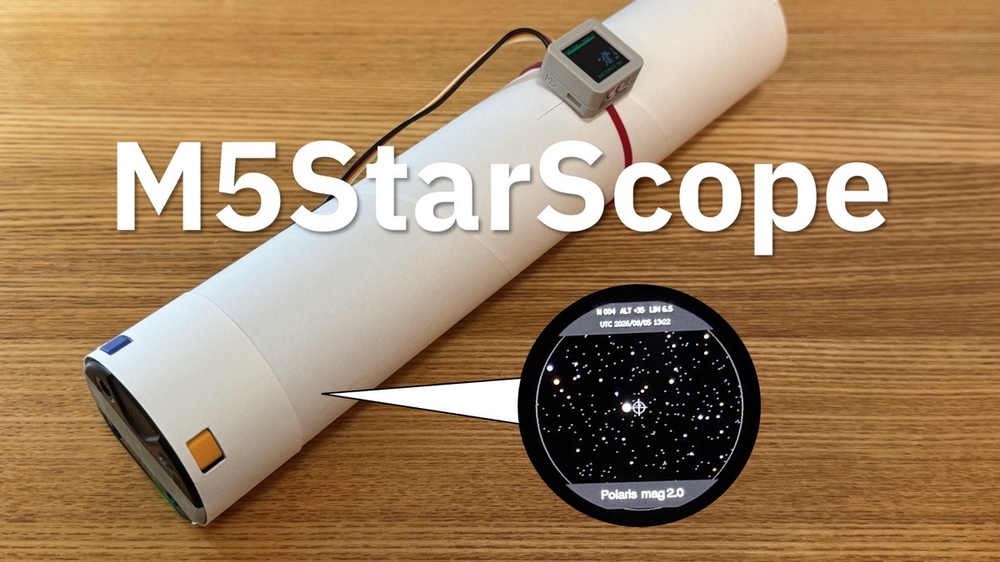
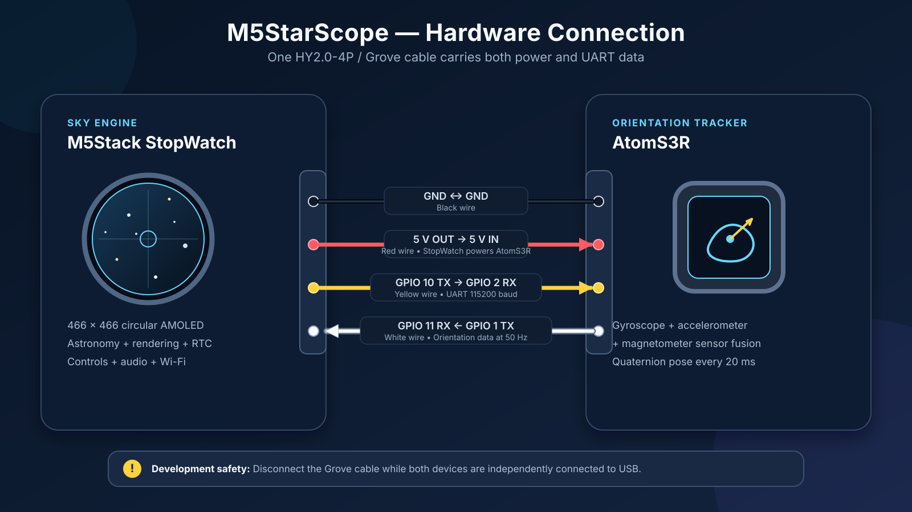
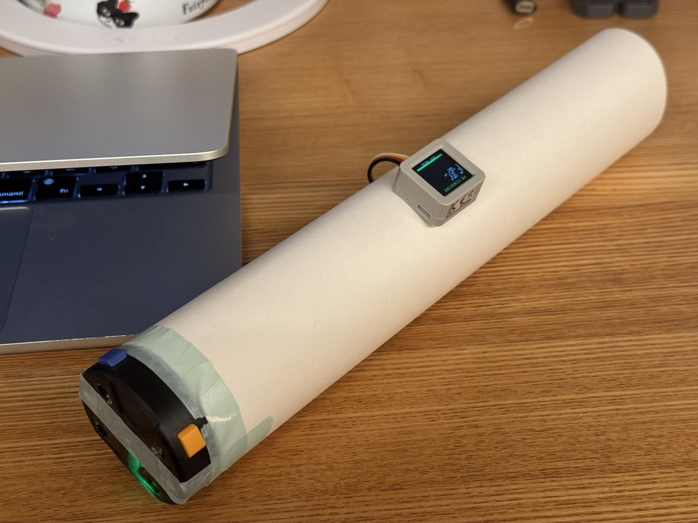

# M5StarScope

<p align="center">
  <a href="docs/M5StarScope_cover.png">
    
  </a>
</p>

M5StarScope is a real-world-synced virtual telescope built from an
[M5Stack StopWatch](https://docs.m5stack.com/en/core/StopWatch), an
[AtomS3R](https://docs.m5stack.com/en/core/AtomS3R), and a simple viewing tube.
It reveals the stars in the direction you point it, using the observation
location, current time, and the telescope's physical orientation.

The stars are still there behind ceilings, clouds, daylight, and city lights.
M5StarScope makes that real sky visible anytime and anywhere, while keeping its
core astronomy and rendering completely offline.

## 💎 Features

### 🔭 A real-world-synced virtual telescope

The 466 x 466 circular AMOLED shows a 45-degree view containing the stars in the
direction of the tube. The embedded catalogue includes 8,921 stars through
magnitude 6.5, together with the Sun, Moon, Mercury, Venus, Mars, Jupiter, and
Saturn. Brightness, stellar color, horizon, compass direction, and the physical
roll of the telescope are rendered in real time.

### 🗣️ A conversational voice guide

Connect an AIAvatarKit-compatible WebSocket server to ask about the sky at the
selected place and time. M5StarScope sends the visible bright stars and
solar-system objects as structured context, records questions through the
StopWatch microphone, and plays responses through its speaker. The telescope
continues to work normally when Wi-Fi or the voice server is unavailable;
language and model support depend on the connected backend.

### 🌙 Night mode for real-sky observation

Move the telescope itself to search naturally instead of translating a flat
star chart into the sky. Red night mode lowers the display brightness and helps
preserve dark adaptation, making it practical to compare the virtual view with
the real sky without ending the experience at the display.

## 🚀 Quick Start

### What you need

- [M5Stack StopWatch (C152)](https://docs.m5stack.com/en/core/StopWatch)
- [M5Stack AtomS3R (C126)](https://docs.m5stack.com/en/core/AtomS3R)
- One HY2.0-4P/Grove cable
- A USB-C data cable for flashing each device
- A viewing tube, ideally about 50 mm in inner diameter and 250 mm long, plus a
  rigid mount for the AtomS3R
- [PlatformIO Core](https://docs.platformio.org/en/stable/core/installation/index.html)
  or PlatformIO IDE for VS Code

PlatformIO downloads the pinned ESP32 platform and library dependencies during
the first build. Verify that its CLI is available before continuing:

```sh
pio --version
```

### 1. Build and test

From the repository root:

```sh
pio test -e native
pio run -e atoms3r
pio run -e stopwatch
```

### 2. Flash the two devices

Keep the Grove cable disconnected while both devices are independently
connected to USB. Flash each firmware separately:

```sh
pio run -e atoms3r -t upload
pio run -e stopwatch -t upload
```

If a device is not detected, put it into download mode by holding its reset or
power button for about two seconds until the internal green LED lights, then
release it and retry the upload.

### 3. Assemble and power on

Disconnect the USB cables, mount the AtomS3R on the tube as described in
[Hardware assembly](#hardware-assembly), and connect the two devices with the
Grove cable. The StopWatch powers the AtomS3R during normal use.

That's it: your M5StarScope is ready. Look into the tube and move it around. The
display should reveal the sky in that direction and follow the movement of the
telescope.

The initial observation location is Tokyo (`35.681236`, `139.767125`, UTC+9),
and the observation time is read from the UTC value currently stored in the
StopWatch RTC. To reproduce the sky at your own place and current time, continue
to [Settings](#settings).

## ⚙️ Settings

### Smartphone setup

1. Hold the AtomS3R screen/button for about two seconds.
2. Connect your phone to the SSID and password shown on the StopWatch.
3. Open `http://192.168.4.1` if the captive portal does not appear automatically.
4. Search for a city by city name, country name, or two-letter country code.
5. Select a result to fill the location name, latitude, longitude, standard UTC
   offset, and magnetic-declination correction.
6. Adjust the UTC offset manually when daylight saving time is active.
7. Optionally enter the Wi-Fi and WebSocket settings for the voice guide.
8. Save the settings, then hold the AtomS3R button again or use the page's exit
   button to return to the telescope.

City search and magnetic-declination calculation are performed on the device
without an Internet connection. You can also enter coordinates manually and
recalculate the declination. Saving the page copies the phone's current UTC
time to the StopWatch RTC. All settings are stored in the StopWatch NVS rather
than compiled into the firmware.

The city catalogue supplies the standard UTC offset. Daylight saving rules
change over time and are intentionally left as a manual adjustment. Magnetic
declination is calculated from the selected coordinates and date using the
embedded World Magnetic Model 2025 (WMM2025), which is valid through the end of
2029.

## 🎛️ Controls and calibration

### Calibrating the orientation tracker

- The AtomS3R display shows azimuth, altitude, roll, magnetic field strength,
  and calibration quality.
- Short-press its screen/button to start a 20-second magnetometer calibration.
- Rotate the complete assembled telescope through all axes until calibration
  finishes. Calibrate it while mounted, not as a loose AtomS3R.
- Keep the AtomS3R away from the StopWatch speaker and other magnets.

### Scope controls

| Control | Short press | Hold for about 1 second |
| --- | --- | --- |
| Yellow / A | Cycle limiting magnitude: 6.5, 5.5, 4.0, 3.0, 2.0, 1.0 | Push to talk; release to send |
| Blue / B | Hide or show the HUD | Toggle red night mode |

Push-to-talk recording is sent automatically after 20 seconds. Pressing and
holding A while the guide is speaking stops the response and begins a new
recording.

If orientation packets from the AtomS3R are absent, `EMU` appears in the HUD.
Drag on the StopWatch display to emulate azimuth and altitude when testing on a
desk.

## 🛠️ Hardware assembly



The HY2.0-4P/Grove cable carries both power and UART data:

| Wire | StopWatch | AtomS3R |
| --- | --- | --- |
| Black | GND | GND |
| Red | 5 V out | 5 V in |
| Yellow | GPIO 10 TX | GPIO 2 RX |
| White | GPIO 11 RX | GPIO 1 TX |

A tube with an inner diameter of approximately 50 mm and a length of
approximately 250 mm is recommended, but the dimensions do not need to be
exact.

> [!TIP]
> No suitable pipe? Roll up a sheet of drawing paper or light cardstock and
> secure it with tape. The first M5StarScope prototype was built exactly this
> way. 😂

<p align="center">
  
  <br>
  <em>The first paper-tube prototype</em>
</p>

Mount the AtomS3R rigidly on top of the tube using this orientation:

- Sensor **+X** points toward the open/front end of the tube.
- Sensor **+Z** points upward, away from the tube.
- The StopWatch display is perpendicular to the tube at the eye end.

> [!TIP]
> If the AtomS3R's geomagnetic heading is unstable or clearly incorrect, remove
> the magnets from the back of the StopWatch. Peel off the rear sticker to find
> the four magnets underneath, then remove all four before recalibrating the
> assembled telescope.

The `kMountYawDeg`, `kMountPitchDeg`, and `kMountRollDeg` constants near the top
of `src/stopwatch/main.cpp` isolate bracket-axis differences from the sensor
fusion. Check their signs once on the completed bracket and adjust them if your
mounting orientation differs.

For comfortable close viewing, place a Google-Cardboard-style convex lens
between the eye and display. A useful starting point is a 30-35 mm lens with a
45-55 mm focal length, positioned approximately one focal length from the
screen. The software field of view remains 45 degrees.

## 🗣️ Voice guide server

<p align="center">
  <a href="https://youtu.be/DQcMpfszUOY">
    
  </a>
  <br>
  <a href="https://youtu.be/DQcMpfszUOY">▶ Watch the voice guide demo on YouTube</a>
</p>

The included Python server connects M5StarScope to OpenAI speech recognition,
a conversational model, and speech synthesis through AIAvatarKit. Run the
server on any computer that the StopWatch can reach. A computer on the same LAN
is the simplest option, but an Internet-reachable host also works.

### 1. Create the Python environment

From the repository root:

```sh
cd server
python -m venv .venv
source .venv/bin/activate
python -m pip install -r requirements.txt
```

On Windows, activate the environment with `.venv\Scripts\activate` instead.

### 2. Set the OpenAI API key and start the server

Create an API key from the
[OpenAI API key page](https://platform.openai.com/settings/organization/api-keys).
The server supports either a local `.env` file:

```dotenv
OPENAI_API_KEY=your-api-key
```

or an environment variable set immediately before startup:

```sh
export OPENAI_API_KEY="your-api-key"
python run.py
```

When using `.env`, start the server with `python run.py` after saving the file.
Never commit `.env`, expose an API key in source code, or include it in firmware.

The server listens on all network interfaces at port `8000`. Keep this terminal
running while using the voice guide, and allow incoming TCP connections to that
port if the computer's firewall asks.

### 3. Connect M5StarScope

Open the M5StarScope [Settings](#settings) page and enter:

| Setting | Value |
| --- | --- |
| Wi-Fi | A network from which the StopWatch can reach the server |
| WebSocket host | The server's LAN IP address, public IP address, or hostname, without `ws://` |
| WebSocket port | `8000` |
| WebSocket path | `/ws` |

Do not use `localhost` or `127.0.0.1`; from the StopWatch, those addresses refer
to the StopWatch itself. Save the settings and return to the scope.

> [!NOTE]
> The included server does not authenticate WebSocket clients. If it is exposed
> to the Internet, restrict access with an appropriate firewall, VPN, or proxy.

## 🌌 Offline data

Generated catalogue sources are committed, so ordinary builds do not download
data. To regenerate them from their upstream datasets:

```sh
python3 tools/build_star_catalog.py path/to/hygdata_v41.csv
python3 tools/build_city_catalog.py path/to/cities15000.zip \
  path/to/countryInfo.txt path/to/timeZones.txt
```

The star catalogue is derived from HYG 4.1 under CC BY-SA 4.0. The city
catalogue is derived from GeoNames under CC BY 4.0, and the magnetic model uses
NOAA/NCEI WMM2025 coefficients. See [THIRD_PARTY_DATA.md](THIRD_PARTY_DATA.md)
for sources and attribution.

## ⚖️ License

The original source code and documentation in this repository are licensed
under the MIT License. Third-party datasets and generated derivatives remain
subject to their respective licenses. See
[THIRD_PARTY_DATA.md](THIRD_PARTY_DATA.md) for details.
